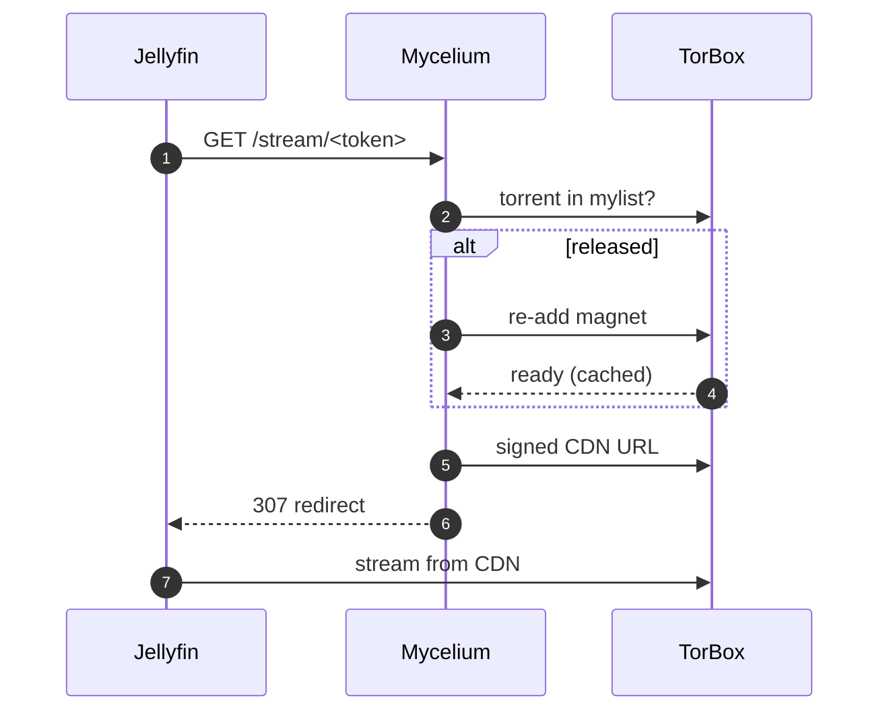
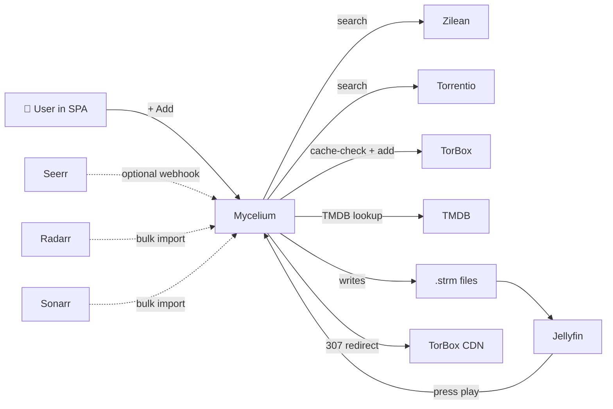

<div align="center">


<p>
  <a href="https://github.com/corveck79/mycelium/releases"></a>
  <a href="https://github.com/corveck79/mycelium/pkgs/container/mycelium"></a>
  
  
  
</p>

<h3>The hidden network beneath your media library.</h3>

<p>
  Self-hosted automation that turns watchlist clicks into Jellyfin-ready streams via
  <a href="https://torbox.app">TorBox</a> — typically under 30 seconds for cached releases,
  with zero local storage.
  Uses <strong><a href="https://docs.elfhosted.com/app/catbox/">Catbox</a> lazy materialization</strong> (opt-in): torrents are pre-warmed in the
  background when you add something, and released after idle time. Library size is effectively
  unlimited. Comes with a built-in <strong>discovery + request UI</strong> (no Seerr needed,
  but Seerr/Jellyseerr webhooks still work if you want them).
</p>

<p>
  <a href="#-why-mycelium">Why</a> ·
  <a href="#-quick-start">Quick start</a> ·
  <a href="#-features">Features</a> ·
  <a href="#-architecture">Architecture</a> ·
  <a href="#-configuration">Configuration</a> ·
  <a href="#-plex-compatibility-opt-in">Plex</a> ·
  <a href="#-faq">FAQ</a>
</p>

</div>

---

<p align="center">
  
</p>

> [!NOTE]
> **Beta.** Mycelium is in active use by a small group of users and works reliably,
> but it's still evolving. Expect occasional breaking changes between releases.
> Primarily tested on Synology NAS + Jellyfin + TorBox. The setup wizard handles
> initial configuration; no `.env` editing required.
> [Open an issue](https://github.com/corveck79/mycelium/issues) if something breaks
> or start a [discussion](https://github.com/corveck79/mycelium/discussions) for questions.

---

## 🍄 What is Mycelium?

Mycelium is a one-container media-request-and-stream pipeline. Browse TMDB, click +Add,
and within seconds a `.strm` file lands in your Jellyfin library that streams directly
from **TorBox**. No FUSE, no rclone, no local downloads.

```
       (a) Built-in Discover (TMDB)      OR    (b) Seerr/Jellyseerr webhook
                  ↓                                       ↓
       search Zilean + Torrentio  →  cache-check TorBox  →  pick the best release
                                          ↓
                          .strm files with Catbox proxy URLs
                                          ↓
                  Jellyfin plays  →  /stream/<token>  →  TorBox CDN (on-demand)
```

Built for the **Jellyfin + TorBox** stack. Plex supported via optional WebDAV.

### Two UIs, one container

| | Path | Purpose |
|--|--|--|
| **SPA** | `/` | Netflix-style poster grids, per-service browsing, library overview, multi-user, watchlist, request management |
| **Admin dashboard** | `/admin` | Operations console: overview, requests, blacklist, maintenance, settings, logs. Embedded within the SPA |

---

## 🌱 Why Mycelium?

The existing debrid-to-media-server toolchain kept breaking: Real-Debrid purged content without warning, FUSE mounts don't survive Synology's kernel, and the strm-based alternatives wiped libraries on restart with no way to diagnose why. Mycelium grew out of a 100-line webhook that kept needing one more fix. It replaces the Sonarr/Radarr/Prowlarr/Bazarr/Seerr/rclone/FUSE stack with a single container that writes `.strm` files directly, no kernel-level mounts needed.

> *Mycelium is the network of fungal threads beneath every forest. It connects the trees and keeps them alive. The mushroom is the only part you see.*

---

## ✨ Features

<details open>
<summary><b>Core pipeline</b></summary>

- 🪝 **Two request paths**: built-in TMDB browser (default) OR Seerr/Jellyseerr webhook.
- 🔎 **Zilean + Torrentio combined search** with deduplication and health-aware skipping.
- ⚡ **TorBox cache-first** strategy with 429 retry and per-hash blacklist.
- 📝 **Jellyfin-friendly naming**: `Movie (Year)/Movie (Year).strm`, `Series/Season XX/Series S01E01.strm`.
- 🎬 **Automatic library refresh**.

</details>

<details open>
<summary><b>🎨 Discover + Library SPA</b></summary>

- **Poster grids** for trending, popular, top rated, now playing, upcoming
- **Per-service filtering**: Netflix, Prime Video, Disney+, HBO Max, Apple TV+, Videoland, NPO Plus, SkyShowtime (NL region by default)
- **Live multi-search** across movies + series
- **Detail modals** with cast, trailers, seasons, where-it-streams badges, recommendations, library status indicator
- **Library view** with movies (available/wanted/upcoming) and series (per-episode status with missing episodes highlighted)
- **Watchlist** per user
- **Multi-user** with optional admin approval flow and per-user auto-approve
- **First-run bootstrap**: the first account you create becomes the admin

</details>

<details>
<summary><b>📥 Auto-add + bulk import</b></summary>

- **Auto-precache**: trending (day/week), popular, top-rated, per-service top lists (Netflix NL Top 10, Prime NL, Disney NL) — only adds items already cached on TorBox, configurable count per category, min rating, min votes
- **Radarr / Sonarr bulk import**: point at an existing Radarr/Sonarr instance, pull all monitored movies/series in one click with live progress bar (added/skipped/errors)

</details>

<details>
<summary><b>🪤 Catbox mode (lazy materialization) -- recommended, opt-in</b></summary>

Inspired by [elfhosted's CatBox](https://docs.elfhosted.com/app/catbox/). Each `.strm` file contains a proxy URL (`/stream/<token>`) instead of a direct CDN link. When `CATBOX_PRELOAD=true` (default), Mycelium pre-warms the entry point in TorBox as soon as you add something: movies immediately, series starting from the first episode of what you requested. For series, each time you watch an episode the next one is automatically preloaded in the background (waterfall) so every episode starts instantly. The torrent is automatically released after `CATBOX_IDLE_MINUTES` of idle time (default 30 days). This means your Jellyfin library can be effectively unlimited without hitting TorBox storage limits.



</details>

<details>
<summary><b>🎯 Smart picks</b></summary>

- **Audio language preference**: boosts releases matching your language(s).
- **Auto-upgrade**: replaces 720p with cached 1080p or 2160p when available.
- **Season-pack consolidation**: swaps *N* per-episode torrents for one cached pack.
- **Trending pre-cache**: TMDB top-N auto-adds if already cached.
- **Trailer detection**: never accidentally plays the sample MP4.

</details>

<details>
<summary><b>🛡 Robustness</b></summary>

- SQLite **WAL mode** plus integrity check on startup, weekly `VACUUM`.
- **Per-IMDB mutex** prevents double-processing.
- **Failed-hash blacklist** after *N* retries.
- **Smart retry backoff** (60m / 6h / 24h).
- **Self-healing** strm probe and cleanup task.
- **Watchdog**: deadman switch (no activity in 24h) and disk-space alerts.
- **Daily DB backup**, 14 retained.
- **Recovery wizard**: one-button repair pipeline.
- **Library import**: rebuild DB from `.strm` files after disaster.
- **Repair broken strm**: Admin → Maintenance → one-click repair for `.strm` files containing expired direct TorBox CDN URLs. Relinks to catbox proxy or requeues for reprocessing.
- **Failed request retry**: Requests page shows failed processing attempts with per-row manual retry button.
- **Docker healthcheck** wired to `/health` so Synology auto-restarts on issues.

</details>

<details>
<summary><b>🖥 UX</b></summary>

- **Web-based setup wizard** on first launch (no `.env` editing required).
- Admin dashboard at `/admin`: overview, requests, blacklist, maintenance, settings, logs. Dark/light theme.
- **Manual search & pick**: see every Zilean/Torrentio candidate, pick exactly which to add.
- **Runtime settings**: toggle Catbox mode, quality filters, etc. without restart.
- **Live stats**: quality distribution, source win-rate, latency, retry queue, library orphans.
- **Service health** dots in topbar.
- **Discord + Telegram** notifications on success, failure, disk, deadman.
- Keyboard shortcuts in admin dashboard.

</details>

<details>
<summary><b>🔌 Integrations</b></summary>

| Integration | What it does |
|---|---|
| `POST /webhook` | Jellyseerr / Overseerr request notifications |
| `POST /torbox-webhook` | TorBox push notifications (skip polling) |
| `GET /dav/...` | Optional read-only WebDAV server for Plex / Emby |
| OpenSubtitles | Auto `.srt` per language (optional) |
| Continue Watching | Prioritize next episodes via Jellyfin Resume API |
| RealDebrid | Multi-debrid fallback for movies and season packs |
| Prometheus / Grafana | `/metrics` endpoint, ready-made dashboard at `assets/grafana-dashboard.json` |

</details>

---

## 📖 Community guides

- **[Proxmox / NAS install guide](docs/install-guide.html)** -- step-by-step walkthrough for both Proxmox LXC and Synology NAS setups, available in English and Dutch. Also available as a [zip bundle](docs/mycelium-install-guide.zip) with `docker-compose.yml` and `.env`.
  Written by [Ventrex](https://github.com/Ventrex07).

---

## 🚀 Quick start

### Prerequisites
- Docker + Docker Compose
- A [TorBox](https://torbox.app) account (Essential plan or higher recommended)
- [Jellyfin](https://jellyfin.org) running

That's it. Out of the box Mycelium uses [Torrentio](https://torrentio.strem.fun) for scraping, which is a public service with no self-hosting required.

**Optional add-ons** (you don't need any of these to get started):
- [Zilean](https://github.com/iPromKnight/zilean): self-hosted local hash index, tried before Torrentio for faster and private search.
- [RealDebrid](https://real-debrid.com): alternative debrid as fallback when TorBox doesn't have a release cached.
- [Jellyseerr](https://jellyseerr.dev) / [Overseerr](https://overseerr.dev): request management via webhook. Mycelium has its own built-in request UI, so this is only needed if you already use Seerr.
- [OpenSubtitles](https://www.opensubtitles.com/en/consumers) API key: auto subtitle download.

### Install

```bash
git clone https://github.com/corveck79/mycelium.git
cd mycelium
docker compose up -d --build
```

Open **`http://<your-nas>:8088`** and the setup wizard walks you through:

1. TorBox API key (the one required thing).
2. Jellyfin URL and API key.
3. TMDB token (required for Discover / posters / metadata).
4. Quality and audio language preferences.
5. Optional Catbox lazy mode.
6. Optional Discord/Telegram notifications.
7. Optional Seerr/Jellyseerr (for inbound webhook requests).

Each connection step has a **Test** button so you find typos before you save. All values land in the runtime settings DB; you can re-run the wizard or edit individual settings via the Settings tab anytime.

The first account you create becomes the admin. The Discover UI is the landing page.

**Seerr is optional.** If you set `SEERR_URL` + `SEERR_API_KEY`, the catchup +
movie/series sync jobs will fetch approved Seerr requests on startup and every
30 minutes. Without Seerr the SPA's Add / Watchlist / Approval flow is the
primary entry point. Webhook endpoint stays available at `/webhook` either way.

Prefer the old-school `.env` workflow? Copy `.env.example` to `.env`, fill it in, click **Skip wizard** on first visit.

---

## 🏗 Architecture



| Component | Where it lives |
|---|---|
| `processor.py` | Request, search, cache check, add to TorBox or lazy-register (catbox) |
| `strm_generator.py` | Writes `.strm` files (direct or proxy URL); `repair_expired_strms()` |
| `catbox.py` | Lazy materialize / release lifecycle for `/stream/<token>` |
| `cleanup.py` | Repair broken strms, rename messy folders, merge duplicates |
| `upgrader.py` | Auto-upgrade quality + season-pack consolidation (catbox-aware) |
| `monitor.py` | New-episode tracking for monitored series |
| `arr_import.py` | Radarr / Sonarr bulk import with live progress |
| `recovery.py` | One-button repair wizard |
| `webdav.py` | Optional read-only WebDAV server for Plex/Emby |
| `app.py` | Flask app, scheduler, UI endpoints |

---

## ⚙️ Configuration

Most settings are **hot-reloadable** via the Settings UI tab. Only scheduler intervals require a container restart.

The full reference lives in [`.env.example`](.env.example). Key knobs:

| Variable | Default | Purpose |
|---|---|---|
| `TORBOX_API_KEY` | *(set via wizard)* | From [torbox.app](https://torbox.app) → Settings → API |
| `CATBOX_MODE` | `false` | Lazy materialization via proxy URLs (opt-in, recommended) |
| `CATBOX_PRELOAD` | `true` | Pre-warm torrent in TorBox on add for instant first play |
| `CATBOX_HOST` | *(set via wizard)* | Externally reachable URL for proxy strm URLs |
| `CATBOX_IDLE_MINUTES` | `43200` | Idle time before a torrent is released from TorBox (30 days) |
| `QUALITY_PREFERENCE` | `1080p,2160p,720p` | Comma-separated preference order |
| `ALLOW_4K` | `true` | Allow 2160p releases |
| `EXCLUDE_REMUX` | `true` | Skip remux releases unless no alternatives |
| `EXCLUDE_BLURAY` | `false` | Skip all BluRay encodes (BDRip, BRRip) |
| `EXCLUDE_CAM` | `true` | Skip CAM/TS/screener |
| `PREFER_WEBDL` | `true` | Prefer WEB-DL sources |
| `PREFER_HEVC` | `true` | Prefer HEVC encodes |
| `MIN_SEEDERS` | `3` | Minimum seeder count |
| `AUDIO_LANGUAGE_PREFERENCE` | *(empty)* | e.g. `nl,en` |
| `AUTO_UPGRADE_ENABLED` | `true` | Periodic upgrade scan |
| `SEASON_PACK_CONSOLIDATION_ENABLED` | `true` | Replace per-episode torrents with packs |
| `TRENDING_PRECACHE_COUNT` | `0` | Top-N TMDB trending to auto-add (cached only) |
| `WEBDAV_ENABLED` | `false` | Serve library as virtual .mkv files (Plex compat) |
| `MULTI_DEBRID_ENABLED` | `false` | RealDebrid fallback when TorBox misses |
| `DISCORD_WEBHOOK_URL` | *(empty)* | Optional notification target |
| `TELEGRAM_BOT_TOKEN` / `TELEGRAM_CHAT_ID` | *(empty)* | Optional notification target |
| `OPENSUBTITLES_API_KEY` | *(empty)* | Optional subtitle download |

---

## 📡 Observability

The container exposes three endpoints:

| Endpoint | Used for |
|---|---|
| `GET /health` | DB-aware liveness, wired to the Docker `HEALTHCHECK`. Returns **503** if SQLite is unreachable. |
| `GET /healthz` | Deep readiness, returns **503** if DB unreachable or both scrapers down. Useful for dashboards. |
| `GET /metrics` | Prometheus exposition. ~20 metrics covering throughput, latency, library size, retry depth, TorBox usage, Catbox state, service health. Scrape interval `30s` works well. |

In **Synology Container Manager** the healthcheck is picked up automatically; a red badge means the container will be auto-restarted within about 3 minutes.

### Grafana dashboard

A ready-made dashboard lives at [`assets/grafana-dashboard.json`](assets/grafana-dashboard.json). It includes:

- 24-hour KPIs (request count, success rate, p95 latency, last-success age, TorBox usage)
- Request rate stack (success vs failed)
- Latency p50 / p95 / p99 lines
- Source win-rate donut (Zilean vs Torrentio)
- Quality distribution bargauge
- Service-health stat tiles
- Library size trend (movies / series)
- Catbox virtual vs materialised gauge
- Retry queue, blacklist and wanted-episodes ops row
- Catbox stream-resolution rate (ok / rematerialized / failed)

To import: **Dashboards → New → Import → Upload JSON file**, then pick your Prometheus datasource.

---

## 🎬 Plex compatibility (opt-in)

Mycelium can serve the library as virtual `.mkv` files via WebDAV. Mount the share at the DSM host and any media server (Plex, Emby, Kodi, Infuse) can scan it like a normal filesystem. The container itself does **not** require FUSE; the mount is done at host level using DSM's built-in `davfs2`.

**Enable it:**

```env
WEBDAV_ENABLED=true
```

(or toggle in the Settings tab once the container is up).

**Mount on the DSM host** (one-time):

```bash
# SSH into DSM, then:
sudo synopkg install davfs2          # via Package Center if not present
sudo mkdir -p /volume1/mycelium-library
sudo mount -t davfs \
    http://localhost:8088/dav \
    /volume1/mycelium-library
```

Add to `/etc/fstab` for auto-remount after reboot:

```
http://localhost:8088/dav  /volume1/mycelium-library  davfs  rw,user,_netdev  0  0
```

**Wire into Plex** in your other compose file:

```yaml
services:
  plex:
    image: plexinc/pms-docker
    volumes:
      - /volume1/mycelium-library:/data/library:ro
    # ... rest of plex config
```

Plex sees `/data/library/movies/Inception (2010)/Inception (2010).mkv` as a regular file. On read, Mycelium streams bytes from TorBox CDN with HTTP Range support so seeking and transcoding work transparently.

**Supported methods:** `OPTIONS`, `PROPFIND`, `HEAD`, `GET` (read-only).

---

## ⚠️ TorBox API rate limits

TorBox enforces two rate limits on `POST /torrents/createtorrent`, both **per IP address** (not per API key):

| Limit | Window | Notes |
|---|---|---|
| **60 requests** | per hour | Rolling window |
| **10 requests** | per minute | Edge burst limit |

All other endpoints are limited to **5 requests/second per IP**.

**Important:** the limits are per IP, so all apps on the same machine share the same quota. If you run other TorBox-connected services, account for their usage.

In **Catbox mode** (default), `createtorrent` is only called on first playback, not at add-time. Subsequent plays use the cached torrent ID directly, so normal single-user usage stays well within the limits.

Mycelium persists the `createtorrent` call log in the DB so the guard counter survives container restarts. The TorBox tab in the dashboard shows current usage broken down by reason.

## ❓ FAQ

<details>
<summary><b>How is this different from TMC?</b></summary>

TMC (TorBox Media Center) is the obvious off-the-shelf option, but in my experience it deletes the entire `.strm` library on restart, crashes during metadata builds, and lacks any UI for figuring out what went wrong. Mycelium rebuilds the same idea with WAL-mode SQLite, per-IMDB mutexes, idempotency on webhooks, daily backups, a recovery wizard, and a dashboard so you can actually see what's happening.

If TMC works for you, great. If it doesn't, this exists.
</details>

<details>
<summary><b>How is this different from elfhosted's CatBox?</b></summary>

CatBox is the gold standard for the lazy-materialise pattern, but it's a managed hosting service: you pay elfhosted, they run it for you. Mycelium runs on your own NAS or VPS, with your own TorBox account, no third-party infrastructure. The Catbox-style mode in Mycelium is directly inspired by their work and credited as such.

Mycelium also targets Seerr webhooks rather than the Radarr/Sonarr ecosystem CatBox supports.
</details>

<details>
<summary><b>Why not just use rclone + Plex?</b></summary>

Rclone requires FUSE inside the container, which on Synology DSM means giving the container `SYS_ADMIN` and a `/dev/fuse` device. That's fragile and breaks across DSM updates. Mycelium writes `.strm` files Jellyfin reads as URLs, no kernel-level magic needed.

Plex doesn't support `.strm` natively, but the optional WebDAV server (see above) closes that gap without rclone.
</details>

<details>
<summary><b>What's the difference between fixed strm and Catbox mode?</b></summary>

In **fixed strm** mode, each `.strm` contains a direct TorBox CDN URL. Simple, works even when Mycelium is down, but URLs expire after about 24 hours.

In **Catbox mode** (`CATBOX_MODE=true`), each `.strm` contains a proxy URL (`/stream/<token>`). With `CATBOX_PRELOAD=true` Mycelium pre-warms the entry point (movie or first episode of the requested season) at add-time so first play is instant. For series, each episode play triggers a background preload of the next episode (waterfall). On playback Mycelium fetches a fresh CDN URL on demand, re-adding the torrent if needed. No URL rot, library size effectively unlimited, but playback requires Mycelium to be running.

Catbox mode is the recommended mode. Enable it via the Settings tab or setup wizard.
</details>

<details>
<summary><b>Does this work with Radarr / Sonarr?</b></summary>

Yes, for **bulk migration**. Admin → Radarr/Sonarr import pulls your entire monitored library in one click and adds everything to Mycelium. Configure `RADARR_URL` + `RADARR_API_KEY` (and the Sonarr equivalents) in Settings, then use the import panel.

For ongoing new-content requests Mycelium's built-in SPA or Seerr webhook is the primary path. It doesn't act as a download client for Radarr's automation loop.
</details>

<details>
<summary><b>I made a bad request and now it's stuck retrying. How do I stop it?</b></summary>

Admin → **Blacklist** tab → add the offending hash, or just `DELETE` the entry from `retry_queue` table. The blacklist auto-fills after `BLACKLIST_FAIL_THRESHOLD` consecutive failures (default 3).
</details>

<details>
<summary><b>Will this run on a Raspberry Pi?</b></summary>

Probably. Memory footprint is about 150 MB. Disk requirements are minimal (`.strm` files are roughly 200 bytes each). The Dockerfile is `python:3.12-slim` which has ARM64 and ARMv7 variants. Untested by me.
</details>

<details>
<summary><b>My library disappeared after a restart!</b></summary>

Most likely the `./data` volume isn't being mounted. Check `docker compose config` and verify `./data:/data`. The DB lives at `/data/requests.db` and `.strm` files at `/data/media`. With the volume preserved, nothing should be lost.

If the DB itself is corrupted: Admin → Overview → **Recovery wizard** rebuilds the DB by scanning the `.strm` map on disk.
</details>

---

## 🗺 Roadmap

See [open issues](https://github.com/corveck79/mycelium/issues) and [discussions](https://github.com/corveck79/mycelium/discussions) for current work and feature requests.

## 🤝 Contributing

PRs and issues welcome. There's no formal style guide. Keep changes focused, run the (sparse) tests in `tests/`, and don't break the dashboard.

Please don't open an issue asking for piracy support. This project is for legitimate, paid TorBox subscribers managing their own content; what you do with it is your own responsibility.

---

## 📜 License

[MIT](LICENSE). Do whatever, just don't blame me if your library disappears.

## 🙏 Credits

- [elfhosted](https://elfhosted.com) for the CatBox concept that inspired the lazy-materialize mode.
- [TorBox](https://torbox.app) for being a reasonably-priced debrid that doesn't suck.
- [Jellyseerr](https://jellyseerr.dev) and [Jellyfin](https://jellyfin.org) for the rest of the ecosystem.
- [Zilean](https://github.com/iPromKnight/zilean) for local-first scraping.
- [Torrentio](https://torrentio.strem.fun) for bottomless fallback.

---

<div align="center">
<sub>built with python, sqlite, and far too many regexes ·
made for self-hosters by a self-hoster</sub>
</div>
