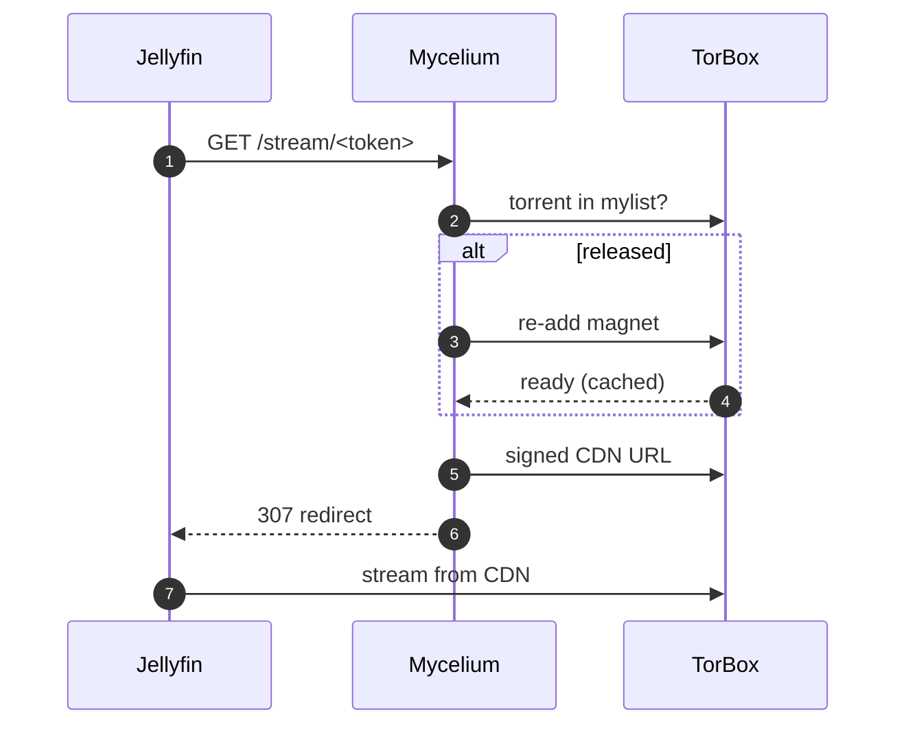
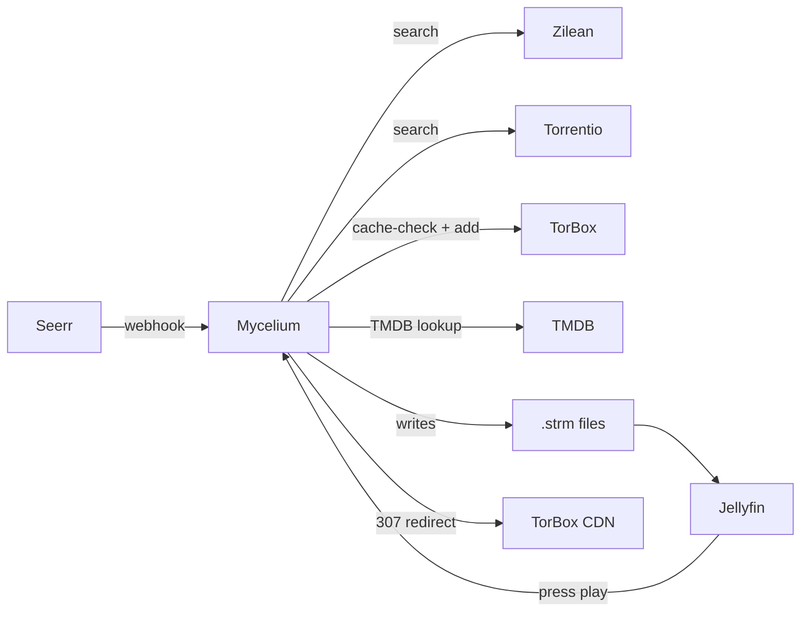

<div align="center">


<p>
  
  
  
  
</p>

<h3>The hidden network beneath your media library.</h3>

<p>
  Self-hosted automation that turns <a href="https://jellyseerr.dev">Seerr</a> requests into
  Jellyfin-ready streams via <a href="https://torbox.app">TorBox</a> in about 30 seconds, with zero local storage.
</p>

<p>
  <a href="#-why-mycelium">Why</a> ·
  <a href="#-quick-start">Quick start</a> ·
  <a href="#-features">Features</a> ·
  <a href="#-architecture">Architecture</a> ·
  <a href="#-configuration">Configuration</a> ·
  <a href="#-plex-compatibility-opt-in">Plex</a> ·
  <a href="#-faq">FAQ</a>
</p>

</div>

---

## 🍄 What is Mycelium?

Mycelium sits between **Seerr**, **TorBox**, and **Jellyfin** and quietly does the boring orchestration so you don't have to:

```
Seerr webhook  →  search Zilean + Torrentio  →  cache-check TorBox
                       ↓
              add the best release         →  Jellyfin-ready .strm file
                       ↓
            (optional) Catbox lazy mode    →  TorBox stays small, library stays huge
```

Built for the **Jellyfin + TorBox + Synology NAS** stack. No FUSE, no rclone, no Plex required (but supported).

---

## 🌱 Why Mycelium?

I've gone through every flavour of self-hosted media stack on my Synology DS920+, and each one had its own way of falling over.

**The Sonarr / Radarr era.** Beautiful in theory: indexers feed the *arrs, the *arrs talk to your download client, content lands on disk, Plex scans it. In practice on a NAS, the *arrs would hang for hours on big-library refreshes, indexer queues would silently stall, and Radarr would happily import a 240p TS as "1080p WEB-DL" because release naming is a war crime. Every fix landed me deeper in indexer / quality-profile / custom-format YAML.

**The rclone + Plex + debrid era.** Skip local storage entirely, mount the debrid library via rclone, point Plex at it. Great until your Synology DSM auto-updates, drops the FUSE module, and your entire library vanishes mid-stream. Or until the rclone container needs `SYS_ADMIN` plus `/dev/fuse` and you spend a Saturday figuring out why the bind mount is read-only this week. Or until Plex starts hammering the mount for thumbnail rebuilds and your debrid account hits its rate limit.

**The TMC + Jellyfin era.** TorBox Media Center generates `.strm` files Jellyfin can play. No FUSE. No mounts. Simple. Except TMC kept tripping over its own feet: wiping my entire `.strm` library on restart, crashing mid-rebuild, leaving Jellyfin staring at a half-built collection. Every few days I was SSHing into the NAS to clean up. There was no UI to figure out what went wrong.

**The CatBox lightbulb.** [elfhosted's CatBox](https://docs.elfhosted.com/app/catbox/) showed there's a smarter pattern: torrents that stay *virtual* in your library until you actually press play, then materialise on demand. The whole idea is gorgeous, but CatBox is a managed hosting service. I wanted that same pattern running on my own NAS, alongside my own containers, without rclone, without giving Docker `SYS_ADMIN`, and without renting somebody else's compute.

So Mycelium is the orchestrator I wished existed:

- **Self-hosted end-to-end.** One container, your data, your hardware.
- **No FUSE in Docker.** `.strm` files for Jellyfin; optional WebDAV at host level for Plex if you really want it.
- **No Radarr / Sonarr.** Seerr makes the request, Mycelium does the rest. No quality profiles to maintain, no indexer drama.
- **Catbox-style lazy mode**, but optional and built in, not bolted on.
- **A real dashboard.** I shouldn't have to `tail -f` to know what's going on.
- **Resilient enough** that my partner can ask "where's that show?" and I don't have to think about it.

If your stack looks like mine, hopefully this saves you a few weekends.

---

## ✨ Features

<details open>
<summary><b>Core pipeline</b></summary>

- 🪝 **Seerr webhook integration**. Every approved request gets auto-processed.
- 🔎 **Zilean (local) + Torrentio (fallback)** with health-aware skipping.
- ⚡ **TorBox cache-first** strategy with 429 retry and per-hash blacklist.
- 📝 **Jellyfin-friendly naming**: `Movie (Year)/Movie (Year).strm`, `Series/Season XX/Series S01E01.strm`.
- 🎬 **Automatic library refresh**.

</details>

<details>
<summary><b>🪤 Catbox mode (lazy materialization)</b></summary>

Inspired by [elfhosted's CatBox](https://docs.elfhosted.com/app/catbox/). Items live in your library as virtual proxies; the torrent only enters TorBox when you press play, and leaves after `CATBOX_IDLE_MINUTES` of idle time. Stays compliant with TorBox's 30-day cache retention while supporting effectively unlimited library size.



</details>

<details>
<summary><b>🎯 Smart picks</b></summary>

- **Per-show overrides**: per-IMDB quality, 4K and HEVC preferences.
- **Audio language preference**: boosts releases matching your language(s).
- **Auto-upgrade**: replaces 720p with cached 1080p or 2160p when available.
- **Season-pack consolidation**: swaps *N* per-episode torrents for one cached pack.
- **Trending pre-cache**: TMDB top-N auto-adds if already cached.
- **Trailer detection**: never accidentally plays the sample MP4.

</details>

<details>
<summary><b>🛡 Robustness</b></summary>

- SQLite **WAL mode** plus integrity check on startup, weekly `VACUUM`.
- **Per-IMDB mutex** prevents double-processing.
- **Failed-hash blacklist** after *N* retries.
- **Smart retry backoff** (60m / 6h / 24h).
- **Self-healing** strm probe and cleanup task.
- **Watchdog**: deadman switch (no activity in 24h) and disk-space alerts.
- **Daily DB backup**, 14 retained.
- **Recovery wizard**: one-button repair pipeline.
- **Library import**: rebuild DB from `.strm` files after disaster.
- **Docker healthcheck** wired to `/health` so Synology auto-restarts on issues.

</details>

<details>
<summary><b>🖥 UX</b></summary>

- **Web-based setup wizard** on first launch (no `.env` editing required).
- Polished dashboard at `/ui`: 11 tabs, sortable tables, TMDB posters, dark/light theme.
- **Manual search & pick**: see every Zilean/Torrentio candidate, pick exactly which to add.
- **Runtime settings**: toggle Catbox mode, quality filters, etc. without restart.
- **Live stats**: quality distribution, source win-rate, latency, retry queue, library orphans.
- **Service health** dots in topbar.
- **Discord + Telegram** notifications on success, failure, disk, deadman.
- Keyboard shortcuts `1` to `9`, `0`.

</details>

<details>
<summary><b>🔌 Integrations</b></summary>

| Integration | What it does |
|---|---|
| `POST /webhook` | Jellyseerr / Overseerr request notifications |
| `POST /torbox-webhook` | TorBox push notifications (skip polling) |
| `GET /dav/...` | Optional read-only WebDAV server for Plex / Emby |
| OpenSubtitles | Auto `.srt` per language (optional) |
| Continue Watching | Prioritize next episodes via Jellyfin Resume API |
| RealDebrid | Multi-debrid fallback for movies and season packs |
| Prometheus / Grafana | `/metrics` endpoint, ready-made dashboard at `assets/grafana-dashboard.json` |

</details>

---

## 🚀 Quick start

### Prerequisites
- Docker + Docker Compose
- A [TorBox](https://torbox.app) account (Essential plan or higher recommended)
- [Jellyseerr](https://jellyseerr.dev) / [Overseerr](https://overseerr.dev) running
- [Jellyfin](https://jellyfin.org) running

That's it. Out of the box Mycelium uses [Torrentio](https://torrentio.strem.fun) for scraping, which is a public service with no self-hosting required.

**Optional add-ons** (you don't need any of these to get started):
- [Zilean](https://github.com/iPromKnight/zilean): self-hosted local hash index, tried before Torrentio for faster and private search.
- [RealDebrid](https://real-debrid.com): alternative debrid as fallback when TorBox doesn't have a release cached.
- [OpenSubtitles](https://www.opensubtitles.com/en/consumers) API key: auto subtitle download.

### Install

```bash
git clone https://github.com/corveck79/mycelium.git
cd mycelium
docker compose up -d --build
```

Open **`http://<your-nas>:8088/ui`** and the setup wizard walks you through:

1. TorBox API key (the one required thing).
2. Jellyfin URL and API key.
3. Seerr URL and API key, plus TMDB token for posters.
4. Quality and audio language preferences.
5. Optional Catbox lazy mode.
6. Optional Discord/Telegram notifications.

Each connection step has a **Test** button so you find typos before you save. All values land in the runtime settings DB; you can re-run the wizard or edit individual settings via the Settings tab anytime.

Then in Seerr: **Settings → Notifications → Webhook** → `http://<your-nas>:8088/webhook`.

Prefer the old-school `.env` workflow? Copy `.env.example` to `.env`, fill it in, click **Skip wizard** on first visit.

---

## 🏗 Architecture



| Component | Where it lives |
|---|---|
| `processor.py` | Request, search, cache check, add to TorBox |
| `strm_generator.py` | Walks TorBox mylist, writes `.strm` files (direct or proxy URL) |
| `catbox.py` | Lazy materialize / release lifecycle |
| `cleanup.py` | Repair broken strms, remove duplicates, regenerate trailers |
| `upgrader.py` | Auto-upgrade and season-pack consolidation |
| `monitor.py` | New-episode tracking for monitored series |
| `recovery.py` | One-button repair wizard |
| `webdav.py` | Optional read-only WebDAV server for Plex/Emby |
| `app.py` | Flask app, scheduler, UI endpoints |

---

## ⚙️ Configuration

Most settings are **hot-reloadable** via the Settings UI tab. Only scheduler intervals require a container restart.

The full reference lives in [`.env.example`](.env.example). Key knobs:

| Variable | Default | Purpose |
|---|---|---|
| `TORBOX_API_KEY` | *(set via wizard)* | From [torbox.app](https://torbox.app) → Settings → API |
| `CATBOX_MODE` | `false` | Lazy materialization (recommended once stable) |
| `CATBOX_HOST` | `http://10.0.0.10:8088` | Externally reachable URL for proxy strm URLs |
| `CATBOX_IDLE_MINUTES` | `60` | Idle time before a torrent is released from TorBox |
| `QUALITY_PREFERENCE` | `1080p,2160p,720p` | Comma-separated preference order |
| `ALLOW_4K` | `true` | Allow 2160p releases |
| `EXCLUDE_REMUX` | `true` | Skip BluRay remux unless no alternatives |
| `EXCLUDE_CAM` | `true` | Skip CAM/TS/screener |
| `PREFER_WEBDL` | `true` | Prefer WEB-DL sources |
| `PREFER_HEVC` | `true` | Prefer HEVC encodes |
| `MIN_SEEDERS` | `3` | Minimum seeder count |
| `AUDIO_LANGUAGE_PREFERENCE` | *(empty)* | e.g. `nl,en` |
| `AUTO_UPGRADE_ENABLED` | `true` | Periodic upgrade scan |
| `SEASON_PACK_CONSOLIDATION_ENABLED` | `true` | Replace per-episode torrents with packs |
| `TRENDING_PRECACHE_COUNT` | `0` | Top-N TMDB trending to auto-add (cached only) |
| `WEBDAV_ENABLED` | `false` | Serve library as virtual .mkv files (Plex compat) |
| `MULTI_DEBRID_ENABLED` | `false` | RealDebrid fallback when TorBox misses |
| `DISCORD_WEBHOOK_URL` | *(empty)* | Optional notification target |
| `TELEGRAM_BOT_TOKEN` / `TELEGRAM_CHAT_ID` | *(empty)* | Optional notification target |
| `OPENSUBTITLES_API_KEY` | *(empty)* | Optional subtitle download |

---

## 📡 Observability

The container exposes three endpoints:

| Endpoint | Used for |
|---|---|
| `GET /health` | DB-aware liveness, wired to the Docker `HEALTHCHECK`. Returns **503** if SQLite is unreachable. |
| `GET /healthz` | Deep readiness, returns **503** if DB unreachable or both scrapers down. Useful for dashboards. |
| `GET /metrics` | Prometheus exposition. ~20 metrics covering throughput, latency, library size, retry depth, TorBox usage, Catbox state, service health. Scrape interval `30s` works well. |

In **Synology Container Manager** the healthcheck is picked up automatically; a red badge means the container will be auto-restarted within about 3 minutes.

### Grafana dashboard

A ready-made dashboard lives at [`assets/grafana-dashboard.json`](assets/grafana-dashboard.json). It includes:

- 24-hour KPIs (request count, success rate, p95 latency, last-success age, TorBox usage)
- Request rate stack (success vs failed)
- Latency p50 / p95 / p99 lines
- Source win-rate donut (Zilean vs Torrentio)
- Quality distribution bargauge
- Service-health stat tiles
- Library size trend (movies / series)
- Catbox virtual vs materialised gauge
- Retry queue, blacklist and wanted-episodes ops row
- Catbox stream-resolution rate (ok / rematerialized / failed)

To import: **Dashboards → New → Import → Upload JSON file**, then pick your Prometheus datasource.

---

## 🎬 Plex compatibility (opt-in)

Mycelium can serve the library as virtual `.mkv` files via WebDAV. Mount the share at the DSM host and any media server (Plex, Emby, Kodi, Infuse) can scan it like a normal filesystem. The container itself does **not** require FUSE; the mount is done at host level using DSM's built-in `davfs2`.

**Enable it:**

```env
WEBDAV_ENABLED=true
```

(or toggle in the Settings tab once the container is up).

**Mount on the DSM host** (one-time):

```bash
# SSH into DSM, then:
sudo synopkg install davfs2          # via Package Center if not present
sudo mkdir -p /volume1/mycelium-library
sudo mount -t davfs \
    http://localhost:8088/dav \
    /volume1/mycelium-library
```

Add to `/etc/fstab` for auto-remount after reboot:

```
http://localhost:8088/dav  /volume1/mycelium-library  davfs  rw,user,_netdev  0  0
```

**Wire into Plex** in your other compose file:

```yaml
services:
  plex:
    image: plexinc/pms-docker
    volumes:
      - /volume1/mycelium-library:/data/library:ro
    # ... rest of plex config
```

Plex sees `/data/library/movies/Inception (2010)/Inception (2010).mkv` as a regular file. On read, Mycelium streams bytes from TorBox CDN with HTTP Range support so seeking and transcoding work transparently.

**Supported methods:** `OPTIONS`, `PROPFIND`, `HEAD`, `GET` (read-only).

---

## ❓ FAQ

<details>
<summary><b>How is this different from TMC?</b></summary>

TMC (TorBox Media Center) is the obvious off-the-shelf option, but in my experience it deletes the entire `.strm` library on restart, crashes during metadata builds, and lacks any UI for figuring out what went wrong. Mycelium rebuilds the same idea with WAL-mode SQLite, per-IMDB mutexes, idempotency on webhooks, daily backups, a recovery wizard, and a dashboard so you can actually see what's happening.

If TMC works for you, great. If it doesn't, this exists.
</details>

<details>
<summary><b>How is this different from elfhosted's CatBox?</b></summary>

CatBox is the gold standard for the lazy-materialise pattern, but it's a managed hosting service: you pay elfhosted, they run it for you. Mycelium runs on your own NAS or VPS, with your own TorBox account, no third-party infrastructure. The Catbox-style mode in Mycelium is directly inspired by their work and credited as such.

Mycelium also targets Seerr webhooks rather than the Radarr/Sonarr ecosystem CatBox supports.
</details>

<details>
<summary><b>Why not just use rclone + Plex?</b></summary>

Rclone requires FUSE inside the container, which on Synology DSM means giving the container `SYS_ADMIN` and a `/dev/fuse` device. That's fragile and breaks across DSM updates. Mycelium writes `.strm` files Jellyfin reads as URLs, no kernel-level magic needed.

Plex doesn't support `.strm` natively, but the optional WebDAV server (see above) closes that gap without rclone.
</details>

<details>
<summary><b>What's the difference between fixed strm and Catbox mode?</b></summary>

In **fixed strm** mode, each `.strm` contains a direct TorBox CDN URL. Simple, works even when this service is down, but URLs may rot after about 30 days as TorBox cycles its cache. The cleanup task repairs them on a 24h schedule.

In **Catbox mode**, each `.strm` contains a proxy URL pointing at this service. On playback we re-add the torrent (if released), fetch a fresh URL, and 307-redirect. No URL rot, library size effectively unlimited, but playback requires Mycelium to be up.

Most people should enable Catbox once they trust the setup.
</details>

<details>
<summary><b>Does this work with Radarr / Sonarr?</b></summary>

Not directly. Mycelium consumes Seerr webhooks, not the qBittorrent API. If you want Radarr / Sonarr compatibility, [elfhosted's CatBox](https://docs.elfhosted.com/app/catbox/) is the production-grade option.
</details>

<details>
<summary><b>I made a bad request and now it's stuck retrying. How do I stop it?</b></summary>

Settings tab → **Blacklist** → add the offending hash, or just `DELETE` the entry from `retry_queue` table. The blacklist auto-fills after `BLACKLIST_FAIL_THRESHOLD` consecutive failures (default 3).
</details>

<details>
<summary><b>Will this run on a Raspberry Pi?</b></summary>

Probably. Memory footprint is about 150 MB. Disk requirements are minimal (`.strm` files are roughly 200 bytes each). The Dockerfile is `python:3.12-slim` which has ARM64 and ARMv7 variants. Untested by me.
</details>

<details>
<summary><b>My library disappeared after a restart!</b></summary>

Most likely the `./data` volume isn't being mounted. Check `docker compose config` and verify `./data:/data`. The DB lives at `/data/requests.db` and `.strm` files at `/data/media`. With the volume preserved, nothing should be lost.

If the DB itself is corrupted: Overview → **🚑 Recovery wizard** rebuilds the DB by scanning the `.strm` map on disk.
</details>

---

## 🗺 Roadmap

- [x] ~~Multi-debrid productionised (RealDebrid as actual fallback)~~. Movies and season-pack series done.
- [x] ~~Plex compatibility via WebDAV~~. Mount via davfs2 on DSM host.
- [x] ~~Prometheus metrics export~~. Exposed at `/metrics`.
- [x] ~~Web-based one-click installer~~. Visit `/ui` on first run.
- [x] ~~Light official theme~~. Toggle from the topbar icon.
- [x] ~~Per-episode RealDebrid fallback~~. Movies, season packs and per-episode all go through RD when TorBox misses.
- [x] ~~Optional auth for the dashboard~~. Password login, trusted-proxy headers, or native OIDC.
- [x] ~~Native OIDC support~~. Works with Authelia, Authentik, Keycloak, Google, Auth0, Okta. Opt-in.

---

## 🤝 Contributing

PRs and issues welcome. There's no formal style guide. Keep changes focused, run the (sparse) tests in `tests/`, and don't break the dashboard.

Please don't open an issue asking for piracy support. This project is for legitimate, paid TorBox subscribers managing their own content; what you do with it is your own responsibility.

---

## 📜 License

[MIT](LICENSE). Do whatever, just don't blame me if your library disappears.

## 🙏 Credits

- [elfhosted](https://elfhosted.com) for the CatBox concept that inspired the lazy-materialize mode.
- [TorBox](https://torbox.app) for being a reasonably-priced debrid that doesn't suck.
- [Jellyseerr](https://jellyseerr.dev) and [Jellyfin](https://jellyfin.org) for the rest of the ecosystem.
- [Zilean](https://github.com/iPromKnight/zilean) for local-first scraping.
- [Torrentio](https://torrentio.strem.fun) for bottomless fallback.

---

<div align="center">
<sub>built with python, sqlite, and far too many regexes ·
made for self-hosters by a self-hoster</sub>
</div>
