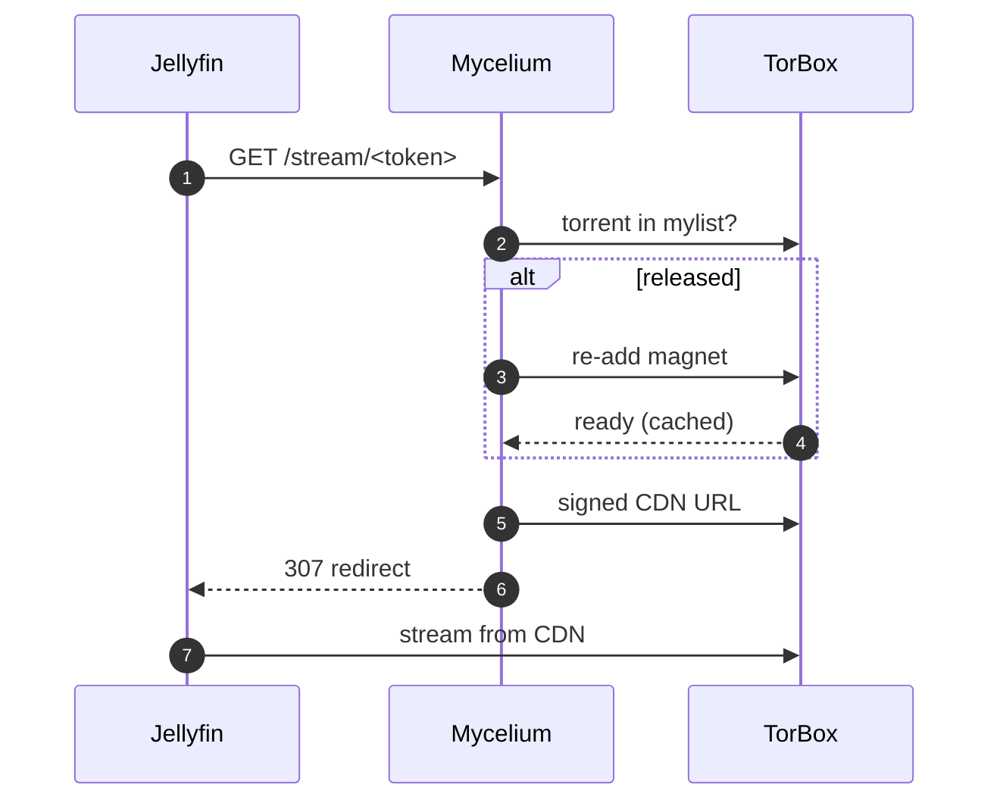
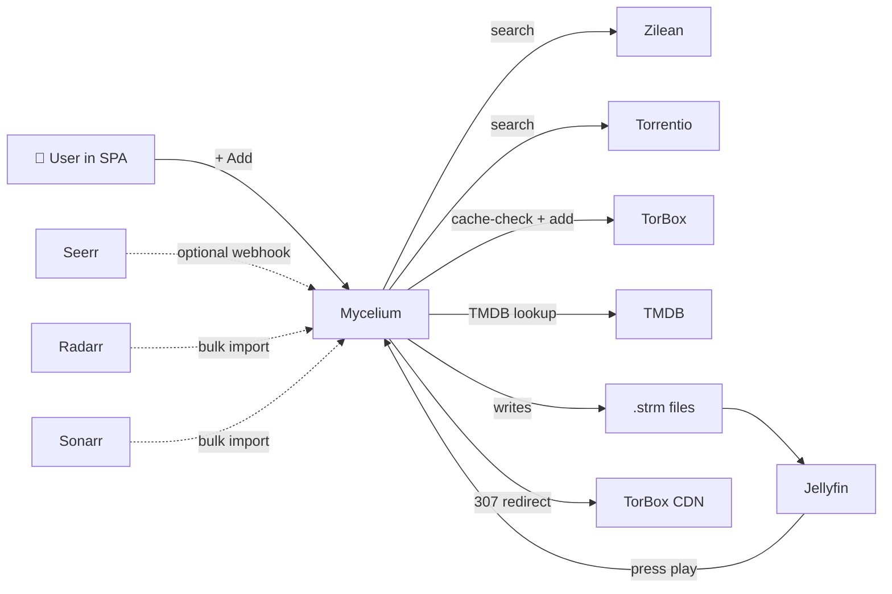

<div align="center">


<p>
  <a href="https://github.com/corveck79/mycelium/releases"></a>
  <a href="https://hub.docker.com/r/corveck/mycelium"></a>
  <a href="https://github.com/corveck79/mycelium/pkgs/container/mycelium"></a>
  
  
</p>

<h3>The hidden network beneath your media library.</h3>

<p>
  One container that turns watchlist clicks into Jellyfin-ready streams via
  <a href="https://torbox.app">TorBox</a> or <a href="https://real-debrid.com">RealDebrid</a> -
  typically under 30 seconds for cached releases, with zero local storage.<br>
  Inspired by <a href="https://docs.elfhosted.com/app/catbox/">elfhosted CatBox</a>:
  torrents are added on-demand at playback, released after idle time.
  Your library can be as large as you want.<br>
  Also includes <strong>Mycelium Spore</strong> — a custom-built Plex integration that streams
  directly from TorBox CDN without rclone, FUSE, or local storage. <em>(experimental)</em>
</p>

<p>
  <a href="#-quick-start">Quick start</a> ·
  <a href="#-features">Features</a> ·
  <a href="#-full-vs-lite">Full vs Lite</a> ·
  <a href="#-architecture">Architecture</a> ·
  <a href="#%EF%B8%8F-configuration">Configuration</a> ·
  <a href="#-faq">FAQ</a>
</p>

</div>

---

<p align="center">
  
</p>

> [!NOTE]
> **Beta.** Mycelium is in active use and works reliably, but it's still evolving.
> Primarily tested on Synology NAS + Jellyfin + TorBox. The setup wizard handles
> initial configuration - no `.env` editing required.
> [Open an issue](https://github.com/corveck79/mycelium/issues) if something breaks.

---

## 🍄 What is Mycelium?

Browse TMDB, click **+ Add**, and within seconds a `.strm` file lands in your Jellyfin library
that streams directly from TorBox or RealDebrid. No FUSE, no rclone, no local downloads.

```
  Built-in Discover UI   OR   Seerr / Jellyseerr webhook
              |                          |
  Zilean + Torrentio  ->  cache-check TorBox / RealDebrid  ->  best release
                                    |
                    .strm files with Catbox proxy URLs
                                    |
          Jellyfin plays  ->  /stream/<token>  ->  CDN (on-demand)
```

**Two UIs, one container:**

| | Path | Purpose |
|--|--|--|
| **SPA** | `/` | Discover, Library, Watchlist, multi-user request management |
| **Admin** | `/admin` | Overview, requests, blacklist, maintenance, settings, logs |

**Works with:**

| Media server | Notes |
|---|---|
| **Jellyfin** | Primary target, fully tested |
| **Emby** | `.strm` support built-in |
| **Kodi** | Add the `.strm` folder as a source |
| **Plex** | Via optional WebDAV (see FAQ) |
| **Infuse** | Via WebDAV |

---

## 🌿 Full vs Lite

One image, two profiles. Choose in the setup wizard or toggle via Settings (restart required).

| Feature | Full | Lite |
|---|:---:|:---:|
| **Always active** | | |
| Webhook handler (Seerr / Jellyseerr) | ✅ | ✅ |
| Processor (torrent search + TorBox) | ✅ | ✅ |
| STRM generator + Catbox | ✅ | ✅ |
| Retry queue + DB backup + watchdogs | ✅ | ✅ |
| Admin dashboard (`/admin`) | ✅ | ✅ |
| **Full only** | | |
| React SPA (Discover, Library, Watchlist) | ✅ | ❌ |
| Web Player (browser streaming) | ✅ | ❌ |
| Trakt scrobbling | ✅ | ❌ |
| Auto-upgrade + season-pack consolidation | ✅ | ❌ |
| Trending / auto-add | ✅ | ❌ |
| **Resources (idle)** | ~290 MB / ~1% CPU | ~140 MB / ~0% CPU |

---

## 🌱 Why Mycelium?

The existing debrid-to-media-server toolchain kept breaking: RealDebrid purged content without warning, FUSE mounts don't survive Synology's kernel, and strm-based alternatives wiped libraries on restart with no way to diagnose why. Mycelium replaces the Sonarr/Radarr/Prowlarr/Bazarr/Seerr/rclone/FUSE stack with a single container.

> *Mycelium is the network of fungal threads beneath every forest. It connects the trees and keeps them alive. The mushroom is the only part you see.*

---

## ✨ Features

<details open>
<summary><b>Core pipeline</b></summary>

- **Two request paths**: built-in TMDB browser OR Seerr/Jellyseerr webhook
- **Zilean + Torrentio** combined search with deduplication and health-aware skipping
- **TorBox + RealDebrid** cache-first strategy with 429 retry and per-hash blacklist
- **Jellyfin-friendly naming**: `Movie (Year)/Movie (Year).strm`, `Series/Season XX/S01E01.strm`
- **Automatic library refresh** after every add

</details>

<details open>
<summary><b>Catbox lazy materialization (recommended)</b></summary>

Each `.strm` contains a proxy URL (`/stream/<token>`) instead of a direct CDN link. Mycelium pre-warms the torrent in TorBox at add-time so first play is instant. For series, each episode play triggers a background preload of the next (waterfall). The torrent is released after idle time. Library size is effectively unlimited.



</details>

<details>
<summary><b>Discover + Library SPA</b></summary>

- Poster grids: trending, popular, top rated, now playing, upcoming
- Per-service filtering: Netflix, Prime, Disney+, HBO Max, Apple TV+, and more
- Live multi-search across movies and series
- Detail modals with cast, trailers, seasons, where-to-stream badges, recommendations
- Library view with movies and per-episode series status
- Watchlist per user, multi-user with admin approval flow

</details>

<details>
<summary><b>Smart picks</b></summary>

- **Audio language preference**: boosts releases matching your language(s)
- **Auto-upgrade**: replaces 720p with cached 1080p or 2160p when available
- **Season-pack consolidation**: swaps per-episode torrents for one cached pack
- **Trending pre-cache**: TMDB top-N auto-adds if already cached on TorBox
- **Radarr / Sonarr bulk import**: pull your entire monitored library in one click

</details>

<details>
<summary><b>Robustness</b></summary>

- SQLite WAL mode + integrity check on startup, weekly VACUUM
- Per-IMDB mutex prevents double-processing
- Failed-hash blacklist after N retries, smart retry backoff (60m / 6h / 24h)
- Self-healing strm probe and cleanup task
- Watchdog: deadman switch and disk-space alerts
- Daily DB backup (14 retained), recovery wizard, library import after disaster

</details>

<details>
<summary><b>Web Player</b></summary>

Stream directly in the browser - no Jellyfin client needed.

- Works in Chrome, Firefox, Safari, Edge, Android
- Remux-only: video always copied, zero NAS CPU
- HEVC as fMP4 HLS, H.264 as mpegts
- Multi-audio language switching, OpenSubtitles fallback
- HDR automatically filtered, falls back to best SDR candidate
- Per-user opt-in via Admin > Users

</details>

<details>
<summary><b>Trakt</b></summary>

- Watched badges on posters in Discover and Library
- Automatic scrobble on playback via Web Player
- Connect via Settings > Trakt (OAuth device flow, no redirect URI needed)

</details>

---

## 🍄 Mycelium Spore *(experimental — work in progress)*

**Mycelium Spore** is a custom-built Plex integration developed specifically for Mycelium. Unlike solutions that require rclone, FUSE mounts, or virtual filesystems, Spore works entirely through a lightweight transcoder wrapper — no kernel modules, no extra daemons, no local storage.

Plex streams directly from TorBox CDN on demand.

```
Plex scans stub .mkv files  →  user presses Play
  →  Plex Transcoder called with -i /plex-media/movie.mkv
  →  plex_transcoder_wrapper.sh rewrites -i to http://mycelium/spore-stream/<token>
  →  FFmpeg reads real video directly from TorBox CDN
  →  Plex serves stream to client
```

**How it works:**
- Mycelium writes a small stub `.mkv` per item into a Plex-scanned folder — no real video data, just enough metadata for Plex to display the library
- A transcoder wrapper intercepts every playback request and replaces the stub path with a live CDN stream URL
- On first play, Mycelium builds a fast-start cache in the background so subsequent seeks are instant
- Audio and subtitle tracks are automatically updated in the stub after first play

**Setup** (Docker Compose):

```yaml
environment:
  - SPORE_ENABLED=true
  - SPORE_MEDIA_PATH=/data/plex-media   # path Plex scans
volumes:
  - ./data/plex-media:/plex-media:ro    # mount into Plex container (read-only)
  - ./spore:/spore                       # wrapper script
```

In your Plex container, add an entrypoint that installs the wrapper once:

```yaml
entrypoint:
  - /bin/sh
  - -c
  - |
    if [ ! -f '/usr/lib/plexmediaserver/Plex Transcoder.real' ]; then
      mv '/usr/lib/plexmediaserver/Plex Transcoder' '/usr/lib/plexmediaserver/Plex Transcoder.real'
    fi
    cp /spore/plex_transcoder_wrapper.sh '/usr/lib/plexmediaserver/Plex Transcoder'
    chmod +x '/usr/lib/plexmediaserver/Plex Transcoder'
    exec /init
```

> **Status:** Confirmed working on Android (Plex app) and Linux desktop. Shield TV testing in progress. Dolby Vision and lossless audio passthrough are not supported — Plex always transcodes via the wrapper.

---

## 🚀 Quick start

**Prerequisites:**
- Docker + Docker Compose
- A [TorBox](https://torbox.app) account (Essential plan or higher recommended)
- [Jellyfin](https://jellyfin.org) running

```bash
docker run -d \
  -p 8088:8088 \
  -v ./data:/data \
  --name mycelium \
  corveck/mycelium:latest
```

Or with Docker Compose:

```bash
git clone https://github.com/corveck79/mycelium.git
cd mycelium
docker compose up -d
```

Open **`http://<your-host>:8088`** - the setup wizard walks you through everything. Each step has a **Test** button. The first account you create becomes admin.

**Optional add-ons** (not needed to get started):
- [Zilean](https://github.com/iPromKnight/zilean) - self-hosted hash index, faster and private
- [RealDebrid](https://real-debrid.com) - fallback debrid when TorBox misses
- [Jellyseerr](https://jellyseerr.dev) / [Overseerr](https://overseerr.dev) - request portal via webhook
- [OpenSubtitles](https://www.opensubtitles.com/en/consumers) - auto subtitle download

---

## 📖 Community guides

- **[Proxmox / NAS install guide](docs/install-guide.html)** - step-by-step for Proxmox LXC and Synology NAS.
  Written by [Ventrex](https://github.com/Ventrex07).

---

## 🏗 Architecture



| Component | Role |
|---|---|
| `processor.py` | Request, search, cache check, add to TorBox |
| `catbox.py` | Lazy materialize / release lifecycle |
| `strm_generator.py` | Writes `.strm` files |
| `monitor.py` | New-episode tracking for monitored series |
| `upgrader.py` | Auto-upgrade quality + season-pack consolidation |
| `cleanup.py` | Repair broken strms, merge duplicates |
| `arr_import.py` | Radarr / Sonarr bulk import |
| `webdav.py` | Optional WebDAV server for Plex/Emby |
| `app.py` | Flask app, scheduler, all routes |

---

## 🔒 Security

- All UI and API routes require login. CSRF protection on all forms.
- **Webhook secret** auto-generated on first start, shown in Admin > Integration Endpoints. Copy to Seerr: Header `X-Webhook-Secret`. Override with `WEBHOOK_SECRET` in `.env`.
- `/setup` locked after first run - admin only via Settings > Re-run wizard.
- `/metrics` requires admin session or `X-Metrics-Token` header (`METRICS_TOKEN` in `.env`).
- WebDAV (`/dav`) uses HTTP Basic Auth against the Mycelium user database.

---

## ⚙️ Configuration

Most settings are hot-reloadable via the Settings tab. Only scheduler intervals require a restart.

Full reference: [`.env.example`](.env.example). Key variables:

| Variable | Default | Purpose |
|---|---|---|
| `TORBOX_API_KEY` | *(wizard)* | From [torbox.app](https://torbox.app) > Settings > API |
| `CATBOX_MODE` | `false` | Lazy materialization via proxy URLs (recommended) |
| `CATBOX_HOST` | *(wizard)* | Externally reachable URL for proxy strm URLs |
| `CATBOX_IDLE_MINUTES` | `43200` | Idle time before torrent is released (30 days) |
| `QUALITY_PREFERENCE` | `1080p,2160p,720p` | Comma-separated preference order |
| `ALLOW_4K` | `true` | Allow 2160p releases |
| `EXCLUDE_REMUX` | `true` | Skip remux releases unless no alternatives |
| `EXCLUDE_CAM` | `true` | Skip CAM/TS/screener |
| `PREFER_WEBDL` | `true` | Prefer WEB-DL sources |
| `PREFER_HEVC` | `true` | Prefer HEVC encodes |
| `MIN_SEEDERS` | `3` | Minimum seeder count |
| `AUDIO_LANGUAGE_PREFERENCE` | *(empty)* | e.g. `nl,en` |
| `AUTO_UPGRADE_ENABLED` | `true` | Periodic upgrade scan |
| `MULTI_DEBRID_ENABLED` | `false` | RealDebrid fallback when TorBox misses |
| `WEBDAV_ENABLED` | `false` | Serve library as virtual .mkv files (Plex) |
| `DISCORD_WEBHOOK_URL` | *(empty)* | Optional notifications |
| `TELEGRAM_BOT_TOKEN` / `TELEGRAM_CHAT_ID` | *(empty)* | Optional notifications |
| `OPENSUBTITLES_API_KEY` | *(empty)* | Auto subtitle download |
| `METRICS_TOKEN` | *(empty)* | Bearer token for `/metrics` scraping |

---

## 📡 Observability

| Endpoint | Purpose |
|---|---|
| `GET /health` | Liveness probe - wired to Docker `HEALTHCHECK` |
| `GET /healthz` | Deep readiness - 503 if scrapers down |
| `GET /metrics` | Prometheus, ~20 metrics. Requires auth (see Security) |

A ready-made Grafana dashboard lives at [`assets/grafana-dashboard.json`](assets/grafana-dashboard.json).

---

## ⚠️ TorBox API rate limits

TorBox enforces two limits on `POST /torrents/createtorrent`, **per IP**:

| Limit | Window |
|---|---|
| 60 requests | per hour |
| 10 requests | per minute |

In Catbox mode (default), `createtorrent` is only called on first playback, not at add-time. Normal single-user usage stays well within the limits. All other endpoints: 5 req/s per IP.

---

## ❓ FAQ

<details>
<summary><b>How is this different from TMC?</b></summary>

TMC deletes the entire `.strm` library on restart, crashes during metadata builds, and has no UI for diagnosing what went wrong. Mycelium rebuilds the same idea with WAL-mode SQLite, per-IMDB mutexes, idempotency on webhooks, daily backups, a recovery wizard, and a dashboard so you can see what's happening.
</details>

<details>
<summary><b>How is this different from elfhosted's CatBox?</b></summary>

CatBox is a managed hosting service. Mycelium runs on your own hardware with your own TorBox account. The Catbox-style lazy mode is directly inspired by their work and credited as such.
</details>

<details>
<summary><b>Fixed strm vs Catbox mode - what's the difference?</b></summary>

**Fixed**: each `.strm` contains a direct TorBox CDN URL. Simple, but URLs expire after ~24h.

**Catbox mode**: each `.strm` contains `/stream/<token>`. Mycelium pre-warms at add-time, fetches a fresh CDN URL on every play. No URL rot, unlimited library size, but Mycelium must be running.
</details>

<details>
<summary><b>How does Plex work?</b></summary>

Use **Mycelium Spore** — see the [Spore section](#-mycelium-spore-experimental--work-in-progress) for setup. No rclone or FUSE required.
</details>

<details>
<summary><b>Does this work with Radarr / Sonarr?</b></summary>

Yes, for bulk migration. Admin > Radarr/Sonarr import pulls your entire monitored library in one click. For ongoing requests, use the built-in SPA or Seerr webhook - Mycelium doesn't act as a Radarr download client.
</details>

<details>
<summary><b>Will this run on a Raspberry Pi?</b></summary>

Probably. Memory footprint ~150 MB in Lite mode. The image ships ARM64 and ARMv7 variants. Untested.
</details>

<details>
<summary><b>My library disappeared after a restart!</b></summary>

The `./data` volume isn't mounted. Check `docker compose config` and verify `./data:/data`. If the DB is corrupted: Admin > Recovery wizard rebuilds it from the `.strm` files on disk.
</details>

<details>
<summary><b>I made a bad request and now it's stuck retrying.</b></summary>

Admin > Blacklist tab > add the offending hash. The blacklist auto-fills after `BLACKLIST_FAIL_THRESHOLD` consecutive failures (default 3).
</details>

---

## 🗺 Roadmap

See [open issues](https://github.com/corveck79/mycelium/issues) and [discussions](https://github.com/corveck79/mycelium/discussions).

---

## 🤝 Contributing

PRs and issues welcome. Keep changes focused, run the tests in `tests/`, and don't break the dashboard. Please don't open issues asking for piracy support - this is for legitimate TorBox subscribers managing their own content.

---

## 📜 License

[MIT](LICENSE). Do whatever, just don't blame me if your library disappears.

If you use Mycelium or build on top of it, a mention or link back to [github.com/corveck79/mycelium](https://github.com/corveck79/mycelium) is appreciated.

## 🙏 Credits

- [elfhosted](https://elfhosted.com) for the CatBox concept that inspired the lazy-materialize mode
- [TorBox](https://torbox.app) for being a solid debrid service
- [Jellyfin](https://jellyfin.org), [Jellyseerr](https://jellyseerr.dev), [Zilean](https://github.com/iPromKnight/zilean), [Torrentio](https://torrentio.strem.fun) for the ecosystem

---

<div align="center">
<sub>built with python, sqlite, and far too many regexes · made for self-hosters by a self-hoster</sub>
</div>
