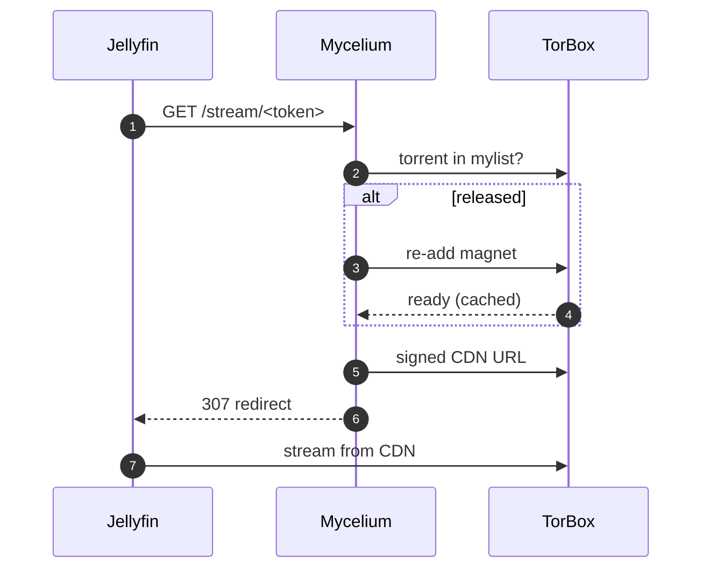
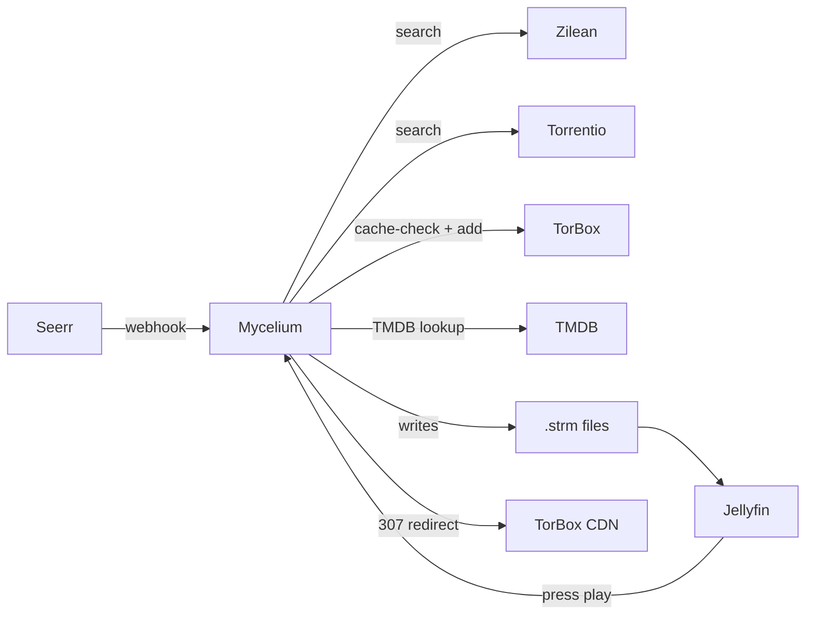

<div align="center">


<p>
  
  
  
  
</p>

<h3>The hidden network beneath your media library.</h3>

<p>
  Self-hosted automation that turns <a href="https://jellyseerr.dev">Seerr</a> requests into
  Jellyfin-ready streams via <a href="https://torbox.app">TorBox</a> — in&nbsp;~30&nbsp;seconds, with zero local storage.
</p>

<p>
  <a href="#-quick-start">Quick start</a> ·
  <a href="#-features">Features</a> ·
  <a href="#-architecture">Architecture</a> ·
  <a href="#-configuration">Configuration</a> ·
  <a href="#-faq">FAQ</a>
</p>

</div>

---

## 🍄 What is Mycelium?

Mycelium sits between **Seerr**, **TorBox**, and **Jellyfin** and quietly does the boring orchestration so you don't have to:

```
Seerr webhook  →  search Zilean + Torrentio  →  cache-check TorBox
                       ↓
              add the best release         →  Jellyfin-ready .strm file
                       ↓
            (optional) Catbox lazy mode    →  TorBox stays small, library stays huge
```

Built for the **Jellyfin + TorBox + Synology NAS** stack. No FUSE, no rclone, no Plex required.

---

## ✨ Features

<details open>
<summary><b>Core pipeline</b></summary>

- 🪝 **Seerr webhook integration** — every approved request auto-processed
- 🔎 **Zilean (local) + Torrentio (fallback)** with health-aware skipping
- ⚡ **TorBox cache-first** strategy with 429 retry + per-hash blacklist
- 📝 **Jellyfin-friendly naming** — `Movie (Year)/Movie (Year).strm`, `Series/Season XX/Series S01E01.strm`
- 🎬 **Automatic library refresh**

</details>

<details>
<summary><b>🪤 Catbox mode (lazy materialization)</b></summary>

Inspired by [elfhosted's CatBox](https://docs.elfhosted.com/app/catbox/). Items live in your library as virtual proxies; the torrent only enters TorBox when you press play, and leaves after `CATBOX_IDLE_MINUTES` of idle time. Stays compliant with TorBox's 30-day cache retention while supporting effectively unlimited library size.



</details>

<details>
<summary><b>🎯 Smart picks</b></summary>

- **Per-show overrides** — per-IMDB quality / 4K / HEVC preferences
- **Audio language preference** — boosts releases matching your language(s)
- **Auto-upgrade** — replaces 720p with cached 1080p / 2160p when available
- **Season-pack consolidation** — swaps *N* per-episode torrents for 1 cached pack
- **Trending pre-cache** — TMDB top-N auto-adds if already cached
- **Trailer detection** — never accidentally plays the sample MP4

</details>

<details>
<summary><b>🛡 Robustness</b></summary>

- SQLite **WAL mode** + integrity check on startup, weekly `VACUUM`
- **Per-IMDB mutex** prevents double-processing
- **Failed-hash blacklist** after *N* retries
- **Smart retry backoff** (60m / 6h / 24h)
- **Self-healing** strm probe + cleanup task
- **Watchdog** — deadman switch (no activity in 24h) + disk-space alerts
- **Daily DB backup** (14 retained)
- **Recovery wizard** — one-button repair pipeline
- **Library import** — rebuild DB from `.strm` files after disaster
- **Docker healthcheck** wired to `/health` → Synology auto-restart

</details>

<details>
<summary><b>🖥 UX</b></summary>

- Polished dashboard at `/ui` — 11 tabs, sortable tables, TMDB posters, dark/light theme
- **Manual search & pick** — see every Zilean/Torrentio candidate, pick exactly which to add
- **Runtime settings** — toggle Catbox mode, quality filters, etc. without restart
- **Live stats** — quality distribution, source win-rate, latency, retry queue, library orphans
- **Service health** dots in topbar
- **Discord + Telegram** notifications on success / failure / disk / deadman
- Keyboard shortcuts `1` – `9`, `0`

</details>

<details>
<summary><b>🔌 Integrations</b></summary>

| Endpoint / module | Purpose |
|---|---|
| `POST /webhook` | Jellyseerr / Overseerr notifications |
| `POST /torbox-webhook` | TorBox push (skip polling) |
| OpenSubtitles | Auto `.srt` per language (optional) |
| Continue Watching | Prioritize next episodes via Jellyfin Resume API |
| RealDebrid scaffolding | Multi-debrid framework (informational today) |

</details>

---

## 🚀 Quick start

### Prerequisites
- Docker + Docker Compose
- A [TorBox](https://torbox.app) account (Essential plan or higher recommended)
- [Jellyseerr](https://jellyseerr.dev) / [Overseerr](https://overseerr.dev) running
- [Jellyfin](https://jellyfin.org) running

That's it — out of the box Mycelium uses [Torrentio](https://torrentio.strem.fun) for scraping, which is a public service with no self-hosting required.

**Optional add-ons** (you don't need any of these to get started):
- [Zilean](https://github.com/iPromKnight/zilean) — self-hosted local hash index, tried before Torrentio for faster + private search
- [RealDebrid](https://real-debrid.com) — alternative debrid as fallback for cases where TorBox doesn't have a release cached
- [OpenSubtitles](https://www.opensubtitles.com/en/consumers) API key — auto subtitle download

### Install

```bash
git clone https://github.com/corveck79/mycelium.git
cd mycelium
cp .env.example .env

# minimum: set TORBOX_API_KEY (and paths if you're not on default NAS layout)
$EDITOR .env

docker compose up -d --build
```

Then in Seerr: **Settings → Notifications → Webhook** → `http://<your-nas>:8088/webhook`.

Open the dashboard at **`http://<your-nas>:8088/ui`**.

### First-run checklist

1. Dashboard → **Settings** → toggle `CATBOX_MODE` if you want lazy materialization
2. Set `AUDIO_LANGUAGE_PREFERENCE` (e.g. `nl,en`)
3. Add a Discord webhook or Telegram bot for notifications
4. Overview → **🚑 Recovery wizard** to baseline the library
5. Done — request a movie in Seerr and watch it appear

---

## 🏗 Architecture



| Component | Where it lives |
|---|---|
| `processor.py` | Request → search → cache check → add to TorBox |
| `strm_generator.py` | Walks TorBox mylist, writes `.strm` files (direct or proxy URL) |
| `catbox.py` | Lazy materialize / release lifecycle |
| `cleanup.py` | Repair broken strms, remove duplicates, regenerate trailers |
| `upgrader.py` | Auto-upgrade + season-pack consolidation |
| `monitor.py` | New-episode tracking for monitored series |
| `recovery.py` | One-button repair wizard |
| `app.py` | Flask app + scheduler + UI endpoints |

---

## ⚙️ Configuration

Most settings are **hot-reloadable** via the Settings UI tab — only scheduler intervals require a container restart.

The full reference lives in [`.env.example`](.env.example). Key knobs:

| Variable | Default | Purpose |
|---|---|---|
| `TORBOX_API_KEY` | — | **Required.** From [torbox.app](https://torbox.app) → Settings → API |
| `CATBOX_MODE` | `false` | Lazy materialization (recommended once stable) |
| `CATBOX_HOST` | `http://10.0.0.10:8088` | Externally reachable URL for proxy strm URLs |
| `CATBOX_IDLE_MINUTES` | `60` | Idle time before a torrent is released from TorBox |
| `QUALITY_PREFERENCE` | `1080p,2160p,720p` | Comma-separated preference order |
| `ALLOW_4K` | `true` | Allow 2160p releases |
| `EXCLUDE_REMUX` | `true` | Skip BluRay remux unless no alternatives |
| `EXCLUDE_CAM` | `true` | Skip CAM/TS/screener |
| `PREFER_WEBDL` | `true` | Prefer WEB-DL sources |
| `PREFER_HEVC` | `true` | Prefer HEVC encodes |
| `MIN_SEEDERS` | `3` | Minimum seeder count |
| `AUDIO_LANGUAGE_PREFERENCE` | *(empty)* | e.g. `nl,en` |
| `AUTO_UPGRADE_ENABLED` | `true` | Periodic upgrade scan |
| `SEASON_PACK_CONSOLIDATION_ENABLED` | `true` | Replace per-episode torrents with packs |
| `TRENDING_PRECACHE_COUNT` | `0` | Top-N TMDB trending to auto-add (cached only) |
| `DISCORD_WEBHOOK_URL` | *(empty)* | Optional notification target |
| `TELEGRAM_BOT_TOKEN` / `TELEGRAM_CHAT_ID` | *(empty)* | Optional notification target |
| `OPENSUBTITLES_API_KEY` | *(empty)* | Optional subtitle download |

---

## 🩺 Healthcheck

The container exposes two endpoints:

| Endpoint | Used for |
|---|---|
| `GET /health` | DB-aware liveness — wired to the Docker `HEALTHCHECK`. Returns **503** if SQLite is unreachable. |
| `GET /healthz` | Deep readiness — returns **503** if DB unreachable **or** both scrapers down. Useful for dashboards. |
| `GET /metrics` | Prometheus exposition. ~20 metrics covering throughput, latency, library size, retry depth, TorBox usage, Catbox state, service health. Scrape interval `30s` works well. |

In **Synology Container Manager** the healthcheck is picked up automatically; a red badge means the container will be auto-restarted within ~3 minutes.

---

## ❓ FAQ

<details>
<summary><b>Why not just use rclone + Plex?</b></summary>

Rclone requires FUSE inside the container, which on Synology DSM means giving the container `SYS_ADMIN` and a `/dev/fuse` device — fragile and breaks across DSM updates. Mycelium writes `.strm` files Jellyfin reads as URLs, no kernel-level magic needed.

Plex doesn't support `.strm` natively. Sorry.
</details>

<details>
<summary><b>What's the difference between fixed strm and Catbox mode?</b></summary>

In **fixed strm** mode, each `.strm` contains a direct TorBox CDN URL. Simple, works even when this service is down, but URLs may rot after ~30 days as TorBox cycles its cache. The cleanup task repairs them on a 24h schedule.

In **Catbox mode**, each `.strm` contains a proxy URL pointing at this service. On playback we re-add the torrent (if released), fetch a fresh URL, and 307-redirect. No URL rot, library size effectively unlimited, but playback requires Mycelium to be up.

Most people should enable Catbox once they trust the setup.
</details>

<details>
<summary><b>Does this work with Radarr / Sonarr?</b></summary>

Not directly. Mycelium consumes Seerr webhooks, not the qBittorrent API. If you want Radarr / Sonarr compatibility, [elfhosted's CatBox](https://docs.elfhosted.com/app/catbox/) is the production-grade option.
</details>

<details>
<summary><b>I made a bad request and now it's stuck retrying — how do I stop it?</b></summary>

Settings tab → **Blacklist** → add the offending hash, or just `DELETE` the entry from `retry_queue` table. The blacklist auto-fills after `BLACKLIST_FAIL_THRESHOLD` consecutive failures (default 3).
</details>

<details>
<summary><b>Will this run on a Raspberry Pi?</b></summary>

Probably. Memory footprint is ~150 MB. Disk requirements are minimal (`.strm` files are ~200 bytes each). The Dockerfile is `python:3.12-slim` which has ARM64 + ARMv7 variants. Untested by me.
</details>

<details>
<summary><b>My library disappeared after a restart!</b></summary>

Most likely the `./data` volume isn't being mounted. Check `docker compose config` and verify `./data:/data`. The DB lives at `/data/requests.db` and `.strm` files at `/data/media`. With the volume preserved, nothing should be lost.

If the DB itself is corrupted: Overview → **🚑 Recovery wizard** rebuilds the DB by scanning the `.strm` map on disk.
</details>

---

## 🗺 Roadmap

- [x] ~~Multi-debrid productionised (RealDebrid as actual fallback)~~ — movies + season-pack series done
- [ ] Plex compatibility via in-container SMB/WebDAV proxy
- [x] ~~Prometheus metrics export~~ — exposed at `/metrics`
- [ ] Web-based one-click installer
- [ ] Light official theme

---

## 🤝 Contributing

PRs and issues welcome. There's no formal style guide — keep changes focused, run the (sparse) tests in `tests/`, and don't break the dashboard.

Please don't open an issue asking for piracy support. This project is for legitimate, paid TorBox subscribers managing their own content; what you do with it is your own responsibility.

---

## 📜 License

[MIT](LICENSE) — do whatever, just don't blame me if your library disappears.

## 🙏 Credits

- [elfhosted](https://elfhosted.com) — the CatBox concept that inspired the lazy-materialize mode
- [TorBox](https://torbox.app) — a reasonably-priced debrid that doesn't suck
- [Jellyseerr](https://jellyseerr.dev) + [Jellyfin](https://jellyfin.org) — the rest of the ecosystem
- [Zilean](https://github.com/iPromKnight/zilean) — local-first scraping
- [Torrentio](https://torrentio.strem.fun) — bottomless fallback

---

<div align="center">
<sub>built with python, sqlite, and far too many regexes ·
made for self-hosters by a self-hoster</sub>
</div>
